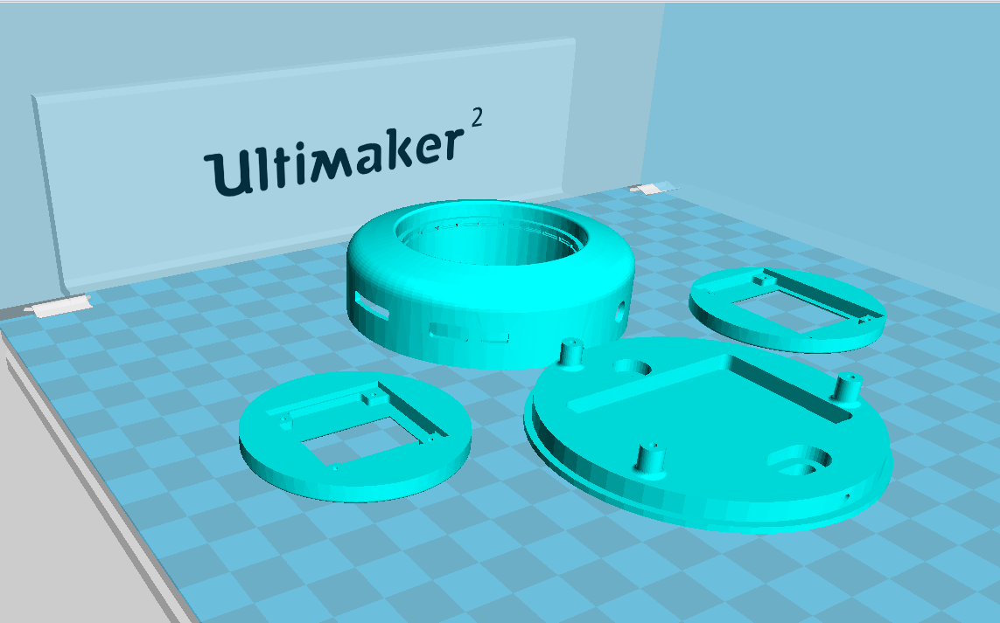

# TAudio-Case
Mini Case for TTGO TAudio (T9)

Supports
- [TTGO T9 Dev Board v1.6](http://www.lilygo.cn/prod_view.aspx?TypeId=50033&Id=1104&FId=t3:50033:3)
- •	interchangeable center caps for speaker, [128x64 SSD1306 two-color I2C oled](https://www.amazon.com/gp/product/B072Q2X2LL), [240x240 ST7789 color SPI oled](https://www.amazon.com/gp/product/B08FB77YY2)
- 3 external buttons
- up to 1200mA Lithium Battery

# Details
This project was designed for a Squeezelite-ESP32 project used with Home-Assistant as an audio and visual notification device.

Step files in  folder.  Print with natural white PLA (translucent) for LEDs
NOTE:  The board is a sketch only.  Dimensions may not be accurate.

Configuration files for squeezelite-ESP32 in  folder

Example yaml files for Home-Assistant in  folder

# General Notes.
I trimmed the rear IO header to prevent interference with the 1200mA battery (see why below)

The T9 board has nearly everything that you need, although there are a couple of issues.
- The I2c header shares a pin with the LED strip.
- The speaker output (disappointingly) needs an external amplifier.    
-  The main IO header pins are a little too short for standard jumpers and connectors ( I assume there is a low profile connector out there somewhere). For the final unit, I soldered  external connections to the header mounting tabs.
-  Most of the exposed IO have pullup resistors pre-installed. (I struggled to get the OLED SPI interface to work without modified code - although it may just be the board I was using)

I haven't yet found a suitable speaker for a "speaker cap" option (as mentioned, will need a driver amp board as well)
