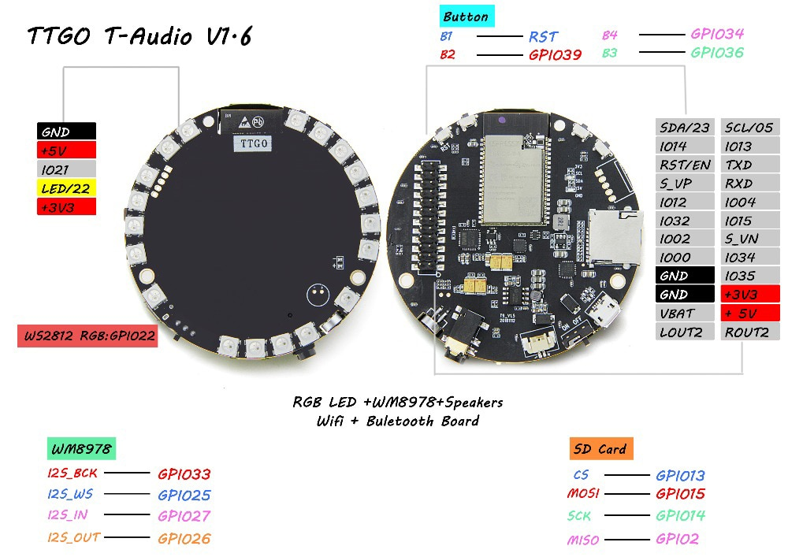

[schematic](schematic.pdf)

[wm8978 datasheet](WM8978_v4.5.pdf)

| GPIO | Assignment| Headers |
|----------------------|-------------|-------------------------------------------------------------------|
| 0 | DAC_MCLK ||
| 2 | SD_DAT0 ||
| 4 | SD_DAT1 ||
| 5 | SPI_SCL ||
| 6 | FLASH_CLK ||
| 7 | PSRAM_SP0 ||
| 8 | PSRAM_SP1 ||
| 9 | PSRAM_SP2 ||
| 10 | PSRAM_SP3||
| 11| FLASH_CS ||
| 12 | SD_DAT2 ||
| 13 | SD_DAT3 ||
| 14 | SD_CLK ||
| 15 | SD_CMD-SPDIF ||
| 16 | PSRAM_CS ||
| 17 | PSRAM_CLK ||
| 18 | DAC_SCL ||
| 19 | DAC_SDA ||
| 21 | I2C_SDA ||
| 22 | LED_VU ||
| 23 | SPI_SDA ||
| 25 | DAC_WS ||
| 26 | DAC_DO ||
| 27 | DAC_DI ||
| 32 | I2S_SCL ||
| 33 | DAC_BCK ||
| 34 | BUTTON1 ||
| 35 | VBAT ||
| 36 | BUTTON2 ||
| 38 | BUTTON3 ||
| RST | RESET ||
