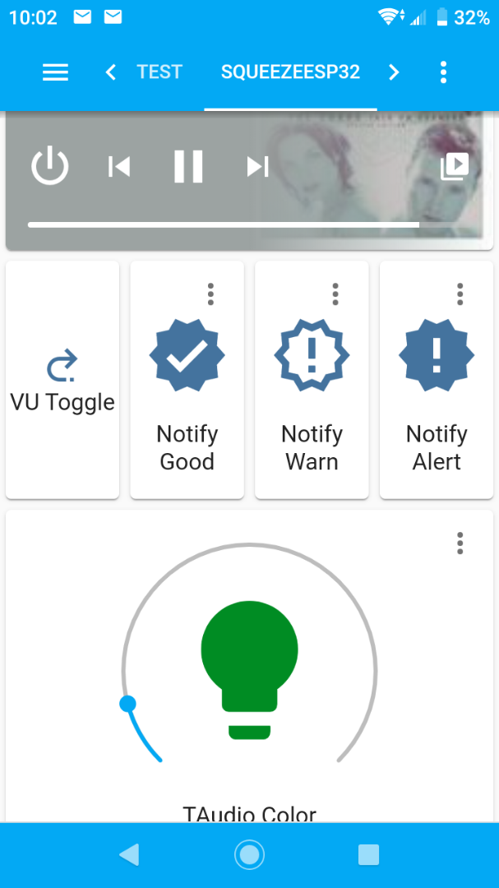
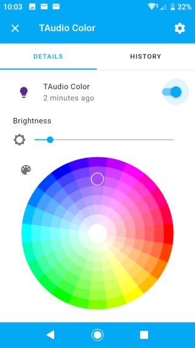

# Home-Assistant Configuration

configuration.yaml includes details of home-assitant configuration to add visual notifications and led color control of the led_vu feature of squeezelite-esp32 firmware.

[Squeezelite-esp32](https://github.com/sle118/squeezelite-esp32) is an Ultra-Cool project to create home built squeezebox devices using custom boards like [SqueezeAmp](https://forums.slimdevices.com/showthread.php?111328-ANNOUNCE-the-SqueezeAMP-next-generation-squeezeboxen-amplifier-receiver) or off-the-shelf ESP32 development boards.  This project is based on the TTGO T9 (TAudio) development board.

The (in development) code changes allow integration with the also Ultra-Cool [Home-Assistant](https://www.home-assistant.io) project, to incorporate into you home automation.  

The yaml examples show how to configure home-assistant to
- Control the LEDS using the light template platform 
- Add notification lights
- Use the device as a text notification device
- Use the device as an audio notification device

 
