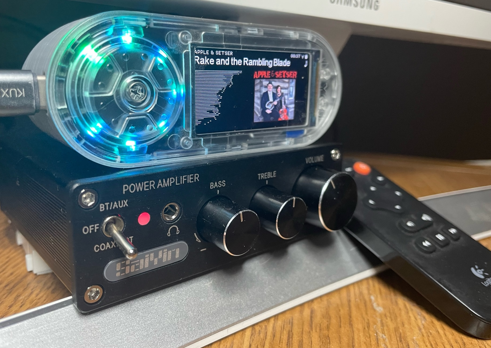

# Squeezelite-Tembed

The TTGO T-embed module has nearly everything you need for a squeezelite-esp32 platform
- ST7789 Display
- I2S Dac and amplifier
- Rotary Dial with Button
- Addressable LEDs

Of course, life is not that simple!  Its a ESP32-S3, which is not fully supported. The display and LEDs also need custom code (but wheres the fun if its just Plug-n-Play 😲 ) 

This project is targeted as a Squeezebox player for an home office.  I have a small d-class power amplifier with an optical input and a pair of small JVC bookshelf speakers that came with an old CD player.

## Case Design
The [OEM repository](https://github.com/Xinyuan-LilyGO/T-Embed/tree/main) has details of the kit, along with some basic shell designs.  My shell/case is based on this, but modified to to accommidate a Toslink transmitter, battery and an IR reciever.

The T-embed kit comes with a a micro speaker, which I have integrated into the design, even though this and the mono DAC are not a priority on this project.  They do function in case we want to look at making a Radio style player.

_NOTE:  The origional design was for a 5mm LED style IR reciever, which would need additional driver electronics.  I used a VS1838B 3-pin version which, once the metal sheild is removed, fits snuggly in the same hole._

## Development code

My [squeezelite-esp32 fork](https://github.com/wizmo2/squeezelite-esp32/tree/dev-tembed-s3) has a dev-tembed-s3 branch.  This currently complies with esp-idf v4.4.5.  The branch includes modified code to support the lower resultion ST7789 SPI display and APA102 leds.  I have cspot manually exculed as it does not complie easily under windows.

The latest version is fully functional.

