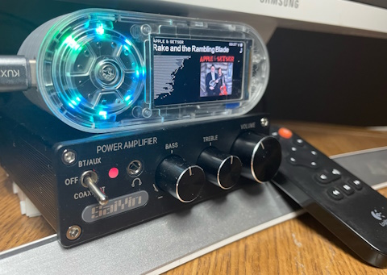
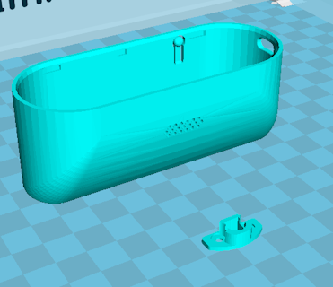

# Squeezelite-Tembed

The TTGO T-embed module has nearly everything you need for a squeezelite-esp32 platform
- ST7789 Display
- I2S Dac and amplifier
- Rotary Dial with Button
- Addressable LEDs

Of course, life is not that simple!  Its a ESP32-S3, which is not fully supported. The display and LEDs also need custom code (but wheres the fun if its just Plug-n-Play 😲 ) 

**_NOTE: ESP32-S3 does not support Bluetooth Audio, so no BT in or out._**

This project is targeted as a PURE Squeezebox player for a home office.  I have a small d-class power amplifier with an optical input and a pair of mini JVC bookshelf speakers that came with an old CD player.

## Case Design
The [OEM repository](https://github.com/Xinyuan-LilyGO/T-Embed/tree/main) has details of the kit, along with some basic shell designs.  My shell/case is based on this, but modified to to accommidate a Toslink transmitter, battery and potentially a Network module.  A clip is included to mount an IR reciever to the back of the module.

The T-embed kit comes with a a micro speaker, which I have integrated into the design, even though this and the mono DAC are not a priority on this project.  They do function in event we want to look at making a Radio style player.

case:[step](tembed-case.STEP)|[model](tembed-case.STEP) ir clip:[step](tembed-ir-clip.STEP)|[model](tembed-ir-clip.STL)

It is necessary to remove the 2 mounting screws and unclip the PCB to solder in header strips. The IR clip can be added under the mounting screws when reassembling.  With the latest design, solder wires directly from the back of the header to the IR sensor.  You can use the ribbon cable and headerr for Toslink only, but the final design may include an ethernet module which will need extra IO.  

## Development code

Use the [Projects Web-Installer](https://wizmo2.github.io/TAudio-Case/), or my [squeezelite-esp32 fork](https://github.com/wizmo2/squeezelite-esp32/tree/dev-tembed-s3) has a dev-tembed-s3 branch.  This needs to be comiled and flashed with esp-idf v4.4.5.  The branch includes modified code to support the lower resultion ST7789 SPI display and APA102 leds.  My PURE build manually excluded BT, Airplay, and CSpot (as they do not currently work well under the S3 platform).

See the [Setup Guide](docs/setup.md) for configuration instructions.   

