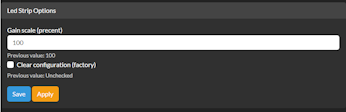

# Tembed Operation Manual
## Flashing
Connect your T-Embed device to a PC, then use the [web-installer page](https://wizmo2.github.io/TAudio-Case/) to flash the latest Squuezbox-Tembed firmware

## WiFi Initialization
- Boot the device, look for a new wifi access point showing up, and connect to it. Default ssid and passwords are "squeezelite":"squeezelite". 
- Once connected, your browser should automatically navigate to 192.168.4.1 
- Wait for the list of access points visible from the device to populate in the web page
- Choose an access point and enter any credential as needed
- Once connection is established, make a note of the address the device received; this is the address you will use to configure it going forward 
- Press "OK" and then reboot the device

## Setup
**This guide assumes you already have a working Logitech Media Server instance running on your local network.**

Install the SqueezeESP32 plugin from the LMS Server Plugin Settings page. _NOTE: Material Skin (re. screenshots), Music Information Screen, LineIn and LineOut plugins are also recommended_

When installed, and additional ESP32 Settings page is available when accessing the LMS Player Extra Settings page list. The Plugin adds an additional menu item to the device display (Extra-SqueezeESP32)

### Device Setup
Use the LMS Player Settings “Configuration” button to access the devices Web-UI.
_NOTE:  You can also use your browser to navigate to the device ip address `http://<device_ip>'_  

A navigation bar provides access to various configuration setting sections.  Each section contains configuration settings with one or more parameters.  The current values are displayed.  Required parameters are indicated with a red (missing) or green icon.  To make changes to a configuration setting, set the parameters as needed and press the "Save" button to commit the changes.  Once all required configuration settings are configured, press the "Apply" button to commit the changes and restart the device. 

#### System-Device Name

The device name sets all named configurations, including the network host name and LMS player name.  _NOTE: additionally the BT, Airplay, and CSpot device names on non-PURE builds_

#### System-Services

Select "ADC(Line-in/Microphone)" service to enable background streaming the microphone audio.  see [Voice Assistant Setup Guide](https://github.com/wizmo2/squeezelite-esp32/blob/pure-v4.x/docs/voice_assistant.md#using-squeezelite-esp32-as-a-voice-assistant-satellite) for detailed instructions.

#### Audio Configuration

The Audio-Squeezelite settings can be used to control the audio stream from LMS. See [README](https://github.com/wizmo2/squeezelite-esp32#additional-configuration-notes-from-the-web-ui) for detailed information.  Additional settings are available in the LMS Player Settings page.

Set the required audio output mode from the drop-down list
- Analogue - speaker
- Digital - Toslink output
- Bluetooth - (not applicable)

### LMS Setup

Use the Player ESP32_Settings page to access additional player configuration for the device.

Recommended settings are
- Artwork: Enabled 120x32
- Spectrum scaling: 10
- LED Brightness: 40
- LED Visualizer: Digital VU Meter

Use the Player Music Information Screen Settings page to configure the Now Playing display configuration, including enabling the 'Show icons for hardware status" to display wifi and battery.  To enable the Music Information Screen, set the Screensaver in the Players Basic Settings page.

## Operation
When powered on, the display and rotary controls allow access to the LMS menus to operate the device.  If installed, an infra-red remote can be sued to navigate the menus.  Remote control is also available throughout the LMS Squeezebox eco-system.  

## Troubleshooting
The device has a number of additional configuration parameters that can be used for troubleshooting and diagnostics.  

### Hardware
The Hardware "Clear" checkbox can be used to reset the configuration setting parameters to factor defaults.

The following configuration settings can be found
- The DAC configures the audio processing hardware. See [README](https://github.com/wizmo2/squeezelite-esp32#daci2s)
- The SPDIF configures the Toslink/SPDIF digital audio output. See [README](https://github.com/wizmo2/squeezelite-esp32#spdif)
- The SPI bus is the communications bus used for display and ethernet. See [README](https://github.com/wizmo2/squeezelite-esp32#spi)
- The I2C bus can be used for external axillaries. See [README](https://github.com/wizmo2/squeezelite-esp32#i2c)
- The built-in OLED Display. See [README](https://github.com/wizmo2/squeezelite-esp32#display) for details on changing orientation.  Additional configuration is available in the LMS Player ESP32 Settings page
- The Rotary control and button See [README](https://github.com/wizmo2/squeezelite-esp32#rotary-encoder) for customized operation modes
- The LED Visualizer controls the RGB LED strip. See [README](https://github.com/wizmo2/squeezelite-esp32#led-strip). The LED visualizer effect and brightness can be changed from the LMS Player ESP32 Settings page
- The ADC configures the microphone input.  see [Voice Assistant Setup Guide](https://github.com/wizmo2/squeezelite-esp32/blob/pure-v4.x/docs/voice_assistant.md#using-squeezelite-esp32-as-a-voice-assistant-satellite) for detailed instructions

   

- The device supports an IR received.  see [README](https://github.com/wizmo2/squeezelite-esp32#infrared) for details on supported remotes.

### Diagnostics
The NVS Editor can be enabled from the Credits menu to expose and additional section to access the raw configurations settings. see [README](https://github.com/wizmo2/squeezelite-esp32#Configuration) for detailed explanations for each setting

The Advanced Commands can be enabled to expose and additional section to access diagnostic parameters. 

## Update Squeezelite
_**WARNING:  The Squeezelite Software Updates should not be used, unless you wish to rest the device to standard firmware**_
- From the firmware tab, click on "Check for Updates"
- Select the firmware version from the list
- Click on "Flash Firmware"
- The system will reboot into recovery mode (if not already in that mode), wipe the Squeezelite partition and download/flash the selected version 

You can choose a local file or have a local webserver

