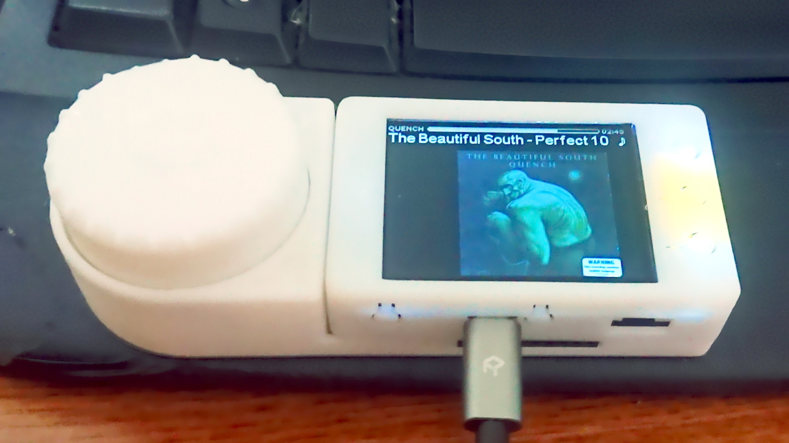
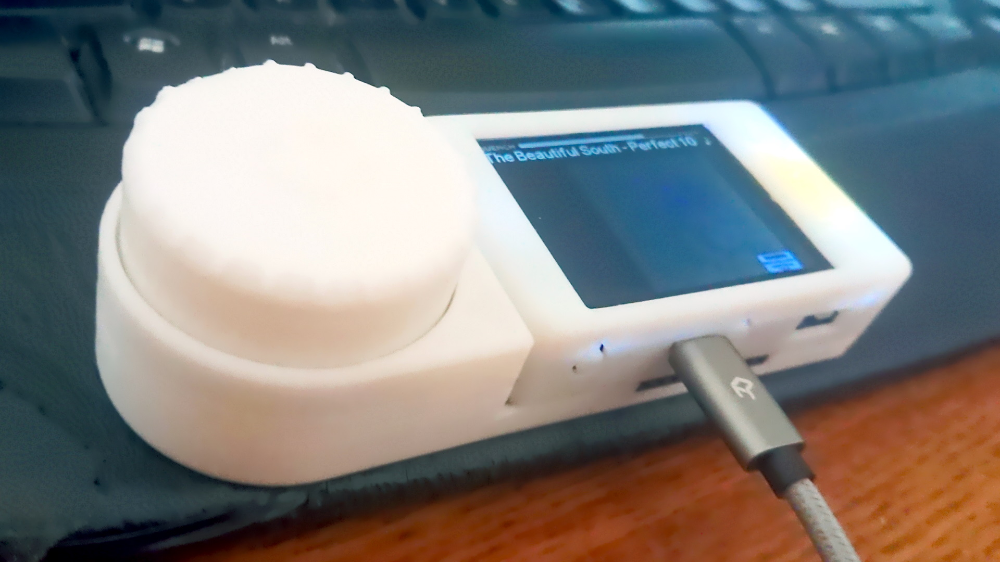

# Squeezebox-Dial
Portable Squeezebox player / Home-Assistant notify device using a T-Watcher module (that comes with a case and adapter board).  I'm using bluetooth out to connect to a mid-end bluetooth bookshelf speaker (as the t-watcher does not have a built-in dac).  The unit is compact and includes a decent sized display.  The addition of a large encoder dial and incorperated led ring results in workable solution, (although the esp32 is working hard with the large format screen and bluetooth decoder requirments)

